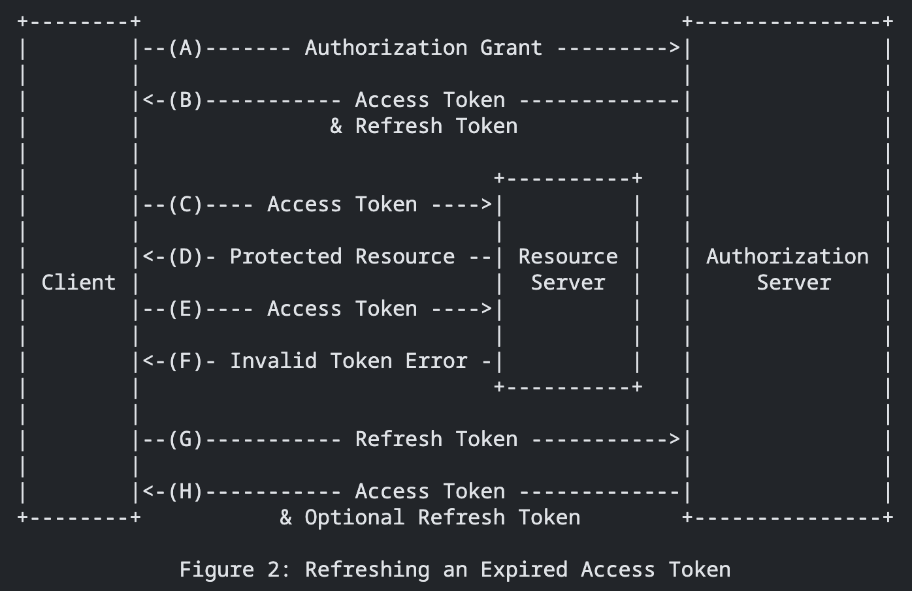

# Access Token & Refresh Token

### Access Token (token-based)

- 使用 JWT 實現，可直接在服務端驗證而無需額外查詢
- 採用較短的過期時間（如 15 分鐘）以提高安全性
- 驗證速度快（約 1ms），因為只需要 JWT decode
- 無狀態設計，適合分散式系統

### Refresh Token (session-based)

- 採用有狀態的 session 機制，儲存在 Redis 中
- 使用較長的過期時間（如 7 天）以維持使用者登入狀態
- 可以即時撤銷特定的 token
- 嚴格控管登入狀態，提供額外的安全層級

### 相比單純使用 JWT 的優勢

- 更高的安全性：access token 短期有效降低被盜用風險
- 可控制性：refresh token 為有狀態，可以有效管理用戶登入狀態
- 靈活的權限管理：可針對不同設備發放不同權限的 token

### 相比單純使用 Session 的優勢

- 效能更好：一般請求只需 JWT decode（約 1ms）而非每次查詢 Redis（約 20-30ms）
- 降低 Redis 負載：只有更新 access token 時才需要查詢 Redis
- 系統彈性：access token 無狀態特性使系統更容易水平擴展

### Flow

Source: [RFC6749](https://datatracker.ietf.org/doc/html/rfc6749#section-1.5)

The flow illustrated in Figure 2 includes the following steps:

(A) The client requests an access token by authenticating with the
authorization server and presenting an authorization grant.

(B) The authorization server authenticates the client and validates
the authorization grant, and if valid, issues an access token
and a refresh token.

(C) The client makes a protected resource request to the resource
server by presenting the access token.

(D) The resource server validates the access token, and if valid,
serves the request.

(E) Steps (C) and (D) repeat until the access token expires. If the
client knows the access token expired, it skips to step (G);
otherwise, it makes another protected resource request.

(F) Since the access token is invalid, the resource server returns
an invalid token error.
